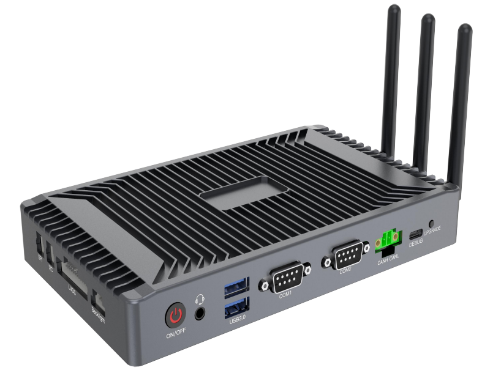
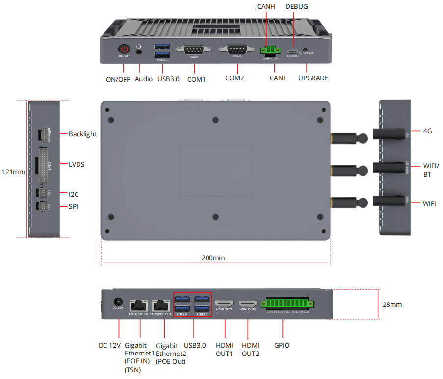

# DEBIX BPC-iMX8MP-08 Industrial Computer

## Overview
BPC-iMX8MP-08 Industrial Computer is composed of a DEBIX customized board and an aluminium alloy enclosure. Engineered for industrial applications with fanless design and compact appearance, it comes with rich interfaces including 4 x DI, 4 x DO, and 1 x CAN. It has strong network connectivity with dual Gigabit Ethernet supporting IEEE 802.3 af, one for POE PSE and the other for POE PD and TSN, 2.4GHz & 5GHz Wi-Fi and Bluetooth 5.3, supports 4G/5G via Mini PCIe. And two HDMI OUT, one LVDS support 4K@30Hz + 1080P@60Hz Dual screen display

## Specification
| System          |       |
|-----------------|-------|
| CPU | NXP i.MX 8M Plus, 4 x ARM Cortex-A53, 1.6GHz, 2.3 TOPS NPU |
| Memory | 2GB LPDDR4 (4GB/8GB optional)|
| Storage | 16GB eMMC (32GB/64GB/128GB/256GB optional) |
| OS | Android 11, Ubuntu 20.04, Debian 12.6, Yocto-L6.6.23_2.2.0, Windows 10 IoT Enterprise (4GB/8GB LPDDR4 version) |
|**Communication** | |
| Gigabit Ethernet | 2 x Gigabit Ethernet ports (independent MAC address), support IEEE 802.3af (1 x POE PD & TSN, 1 x POE PSE) |
| WiFi & BT | 1 x M.2 2230 2.4GHz&5GHz WiFi and BT5.3 Combo Module (optional) |
| 4G | 1 x Mini PCIe for 4G/5G Module (optional) |
|Antenna | 3 x ANT (1 x 4G Main ANT, 1 x WiFi Main ANT, 1 x WiFi Diversity ANT+BT Main ANT) |
| HDMI | 2 x HDMI OUT
| LVDS | 1 x LVDS, single & dual channel 8 bit
| Backlight | 1 x Backlight for LVDS
| Audio | 1 x 3.5mm Headphone and Mic combo port
|**I/O Interface**|
| LED & KEY | (1) 1 x ON/OFF System Key with LED (2) 1 x Upgrade Key (eMMC firmware upgrade and update for system storage)
| DC IN | 1 x DC IN female connector
| USB 3.0 | 6 x USB 3.0 Host
| Debug | 1 x System Debug
| COM | 2 x COM (RS232 for default, supports RS485 via internal DIP switch)
| CAN |  1 x CAN
| I2C | 1 x I2C
| SPI | 1 x SPI
| DIN/DO | (1) 4 x Digital Output (2) 4 x Digital Input
|**Power Supply**|
| Power Input | DC 12V/3A | 
|**Mechanical & Environmental**|
| Dimension |  200.0mm x 121.0mm x 28.0mm (±0.5mm)
| Net Weight (PCBA) |  175g (±0.5g)
| Net Weight (PCBA+Enclosure) | 637g (±0.5g) (excluding antennas)
| Operating Temp. | -20°C ~ +70°C (-40°C ~ +85°C optional)
| Enclosure Color | Grey (Black is optional)
| Enclosure Material | Aluminum alloy

<!--
## Product Compliance and Safety
CE | FCC | UKCA | RoHS | RCM  
*For more information see [the Certificates in the DEBIX Knowledge Center](https://debix.io/Document/certificates.html)*  
-->

## I/O Interfaces and Dimension:

<!--
## Ordering Codes
| RAM LPDDR4  | eMMC Storage | PN for BPC-iMX8MP-05 -20°C to 70°C | PN for BPC-iMX8MP-05 -40°C to 85°C |
|-------------|--------------|----------------|---------------------|
| **1GB DDR** | 8GB   | BPC-iMX8MP-05-D1E8    | BPC-iMX8MP-05-I-D1E8 |
|             | 16GB  | BPC-iMX8MP-05-D1E16   | BPC-iMX8MP-05-I-D1E16 |
|             | 32GB  | BPC-iMX8MP-05-D1E32   | BPC-iMX8MP-05-I-D1E32 |
|             | 64GB  | BPC-iMX8MP-05-D1E64   | BPC-iMX8MP-05-I-D1E64 |
| **2GB DDR** |  8GB   | BPC-iMX8MP-05-D2E8    | BPC-iMX8MP-05-I-D2E8 |
|             | 16GB  | BPC-iMX8MP-05-D2E16   | BPC-iMX8MP-05-I-D2E16 |
|             | 32GB  | BPC-iMX8MP-05-D2E32   | BPC-iMX8MP-05-I-D2E32 |
|             | 64GB  | BPC-iMX8MP-05-D2E64   | BPC-iMX8MP-05-I-D2E64 |
| **4GB DDR** | 8GB   | BPC-iMX8MP-05-D4E8    | BPC-iMX8MP-05-I-D4E8 |
|             | 16GB  | BPC-iMX8MP-05-D4E16   | BPC-iMX8MP-05-I-D4E16 |
|             | 32GB  | BPC-iMX8MP-05-D4E32   | BPC-iMX8MP-05-I-D4E32 |
|             | 64GB  | BPC-iMX8MP-05-D4E64   | BPC-iMX8MP-05-I-D4E64 |
| **8GB DDR** | 8GB   | BPC-iMX8MP-05-D8E8    |    |
|             | 16GB  | BPC-iMX8MP-05-D8E16   |    |
|             | 32GB  | BPC-iMX8MP-05-D8E32   |    |
|             | 64GB  | BPC-iMX8MP-05-D8E64   |    |

-->

## Compatible with DEBIX's Accessories
| Product                     | Model               |
|-----------------------------|---------------------|
| DEBIX Display Screens      | DEBIX TD050H; DEBIX TD070H; DEBIX TD101H |

## Safety Instructions and Warnings:
**To avoid malfunction or damage to this product please observe the following:**
- Disconnect the device from the DC power supply before cleaning. Use a damp rag. Do not use liquid detergents or spray-on detergents.
  
- Keep the device away from moisture.

- During installation, put the device on a reliable table. It will be damaged if you drop it.

- Before connecting the power supply, ensure that the voltage is in the required range.

- Put the power cable in place to avoid stepping on it.

- The air vent in the bottom of the enclosure is used for heat dissipation. To prevent the device from overheating, don't cover the hole.

- If the device is not used for a long time, power it off to avoid damage caused by sudden overvoltage.

- Do not pour liquid into the hole of the enclosure, as this could cause fire or electrocution.

- For safety reasons, the device can only be disassembled by professional personnel.

- Do not place the device in a place where the ambient temperature is below -40℃ or above 85℃. This will damage the machine. It needs to be kept in an environment at controlled temperature.

## Contact Us
- **Headquarters**: DEBIX Technology Inc., 8345 Gold River Ct., Las Vegas, NV 89113, USA  
- **Factory**: 5-6/F., East Zone, Shunheda A2 Building, Liqxiandong Industrial Park, XiLi, Nanshan Dist., Shenzhen, China  
- **Email**: info@debix.io  
- **Website**: [www.debix.io](https://www.debix.io)  
- **Community**: [Discord](https://discord.com/invite/adaHHaDkH2)